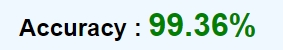
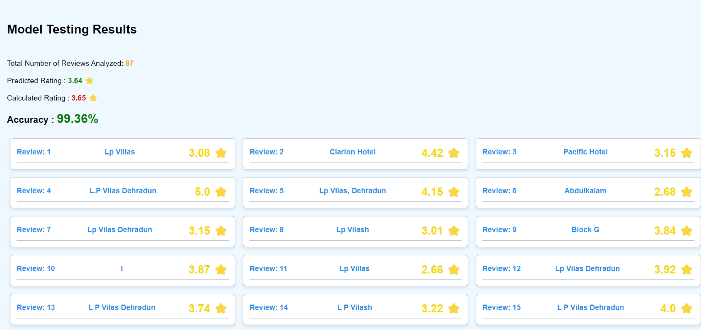
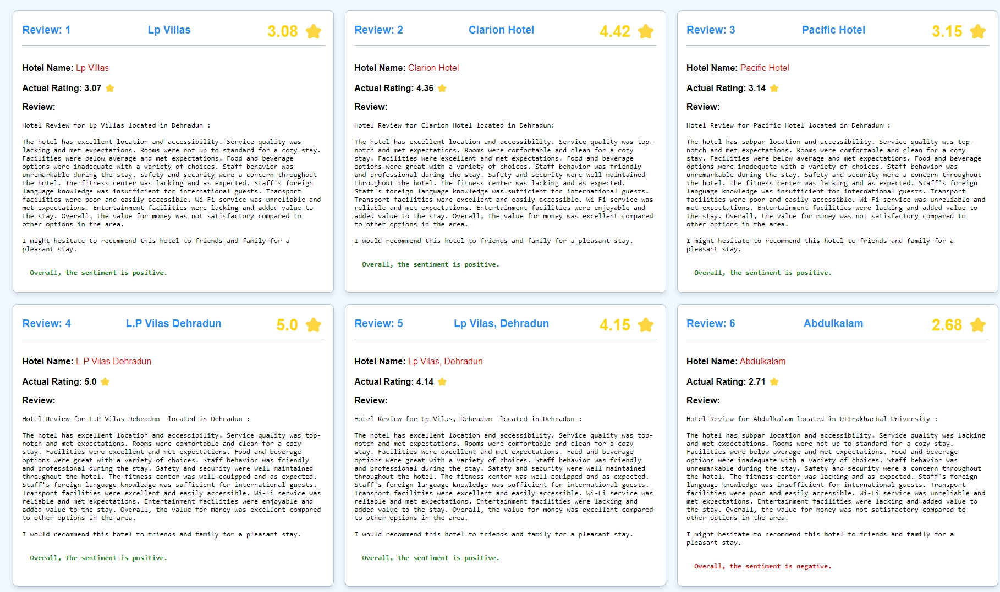
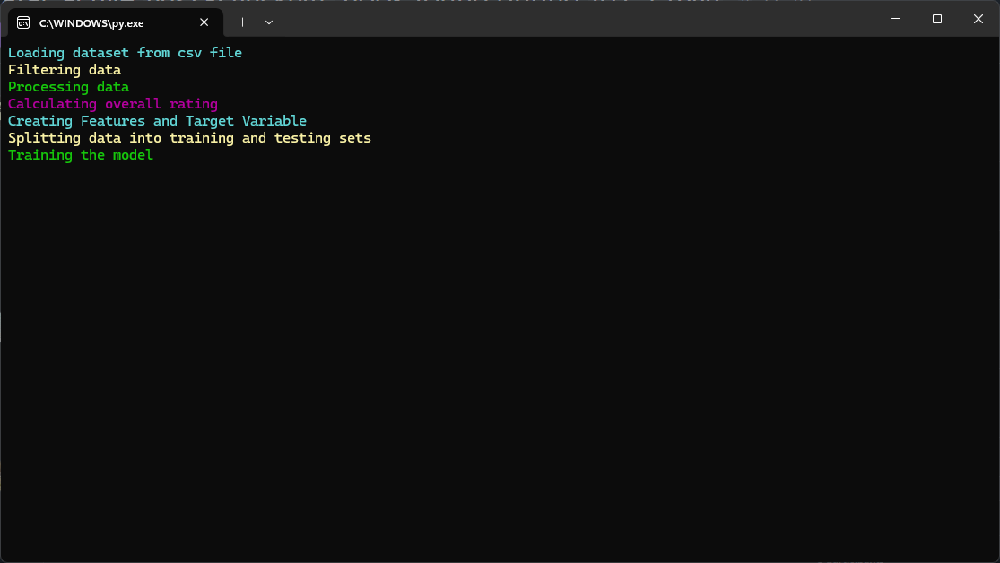

# Hotel Review Sentiment Analysis

Welcome to the **Hotel Review Sentiment Analysis** repository! This project involves training Machine Learning models using a dataset of over 300 authentic hotel reviews to predict overall ratings and generate insightful visualizations.  

This repository is structured to support ease of understanding, scalability, and modularity. It includes datasets, trained models, and a Jinja2-based visualization application.

<p align="center">
   
</p>


**Models trained have an astonising accuracy of around 99% 🤯**

> ### See these models getting implemented in real world at : [Rate My Hotel](https://github.com/Krishna-Noutiyal/RateMyHotel)

Automatic Data Visualization
--

Now, you can get insight on the performance your trained model with **Automatic Data Visualization** with zero efforts.



Detailed Review Generation
--

Other then just training hotel review models, you also get an automatic detailed review generation and user sentiment analysis to further support the model rating.



Beautiful Model Training Interface
--

Forget boring training screens with a colorful terminal output 😆



## 📂 Repository Structure

### **Folders**
1. **`data`**  
   Contains datasets used for training and testing the ML models. The data is clean, structured, and ready for model consumption.  
   - **Purpose**: To store and organize the data in CSV or other relevant formats.

2. **`models`**  
   Includes trained models along with their corresponding feature files (`.pkl`) for consistency and reuse.  
   - **Purpose**: To save pre-trained ML models for reuse and evaluation without retraining.

3. **`output`**  
   Houses HTML files generated via the Jinja2 application for visualizing the model's predictions.  
   - **Purpose**: To provide a user-friendly, well-formatted summary of the results.

4. **`template`**  
   Contains Jinja2 templates used to generate HTML files in the `output` folder.  
   - **Purpose**: To ensure separation of content (data) and presentation (HTML formatting).

### **Files**
- **`filtering.py`**: Prepares and filters raw data for model input.  
- **`processing.py`**: Handles data transformation, normalization, and scaling.  
- **`analytics.py`**: Generates analytical insights, including metrics like accuracy and precision.  
- **`reviews.py`**: Generates detailed reviews (long or short) based on predictions.  
- **`output.py`**: Saves or displays the output of the model predictions.  
- **`testing.py`**: Facilitates model testing and evaluation.  
- **`train_model.py`**: Contains code for training the ML models and saving them for later use.  

---

## ✨ Features
- **Trained Models**: Predict hotel ratings using highly accurate ML models.
- **Data Visualization**: Leverages Jinja2 templates to create visually appealing HTML reports.
- **Modular Codebase**: Well-organized scripts for data preprocessing, model training, and output visualization.
- **Reusable Models**: Pickle files for models and features to save retraining time.
- **User-Friendly Output**: Beautifully formatted HTML files to showcase model predictions.

---

## 🛠️ Technologies Used
- **Python**: Core programming language.
- **Scikit-Learn**: For machine learning model development.
- **Jinja2**: For templating HTML visualizations.
- **Pandas & NumPy**: For data handling and processing.
- **Matplotlib**: For additional data visualization (if needed).
- **Joblib**: For saving and loading trained models.
- **Textblob**: For sentiment analysis

---

## 🚀 Getting Started

### Prerequisites
- Python 3.11+
- Libraries: Install dependencies from `req.txt`:
  ```bash
  pip install -r req.txt
  ```

### Running the Project
1. **Train the Model**: Use `training.py` to train the model with data from the `data` folder.
2. **Test the Model**: Run `testing.py` to evaluate the model and generate reviews.
3. **Visualize Results**: Check the `output` folder for beautifully formatted HTML files showing predictions.

---

## 📊 Example Workflow
1. Place your dataset in the `data` folder.  
2. Train your model using:
   ```bash
   python train_model.py
   ```
3. Test the model with:
   ```bash
   python testing.py
   ```
4. Open the generated HTML files in the `output` folder for a detailed visualization of the predictions.

---

## 🛡️ Project Highlights
- **Accuracy**: The model achieves a current accuracy of **74.48%**, with room for improvement.  
- **Scalability**: Easily extendable for larger datasets or additional features.  
- **Visualization**: Simplifies decision-making with formatted HTML reports.

---

## 📈 Future Enhancements
- Improve model accuracy using advanced algorithms.  
- Add real-time predictions via a web or desktop app.  
- Support multilingual reviews.  
- Integrate more visualizations for better insights.

---

## 🤝 Contributing
Feel free to submit issues or pull requests! Contributions are welcome to improve the repository further.

---

## 📄 License
This project is licensed under the [MIT License](LICENSE).  

---

Let me know if you need further adjustments or additional sections! 😊
